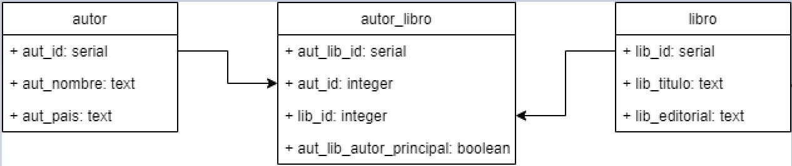
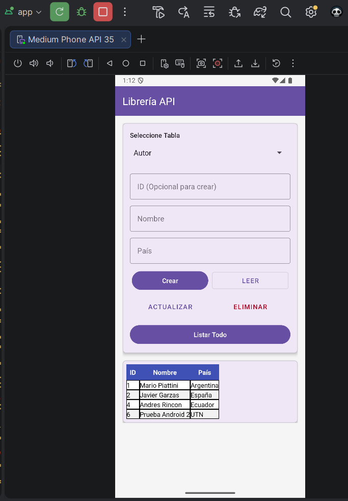
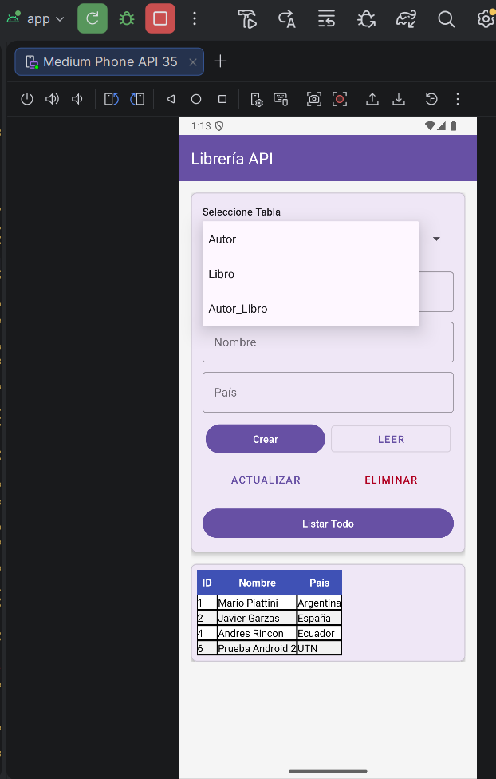
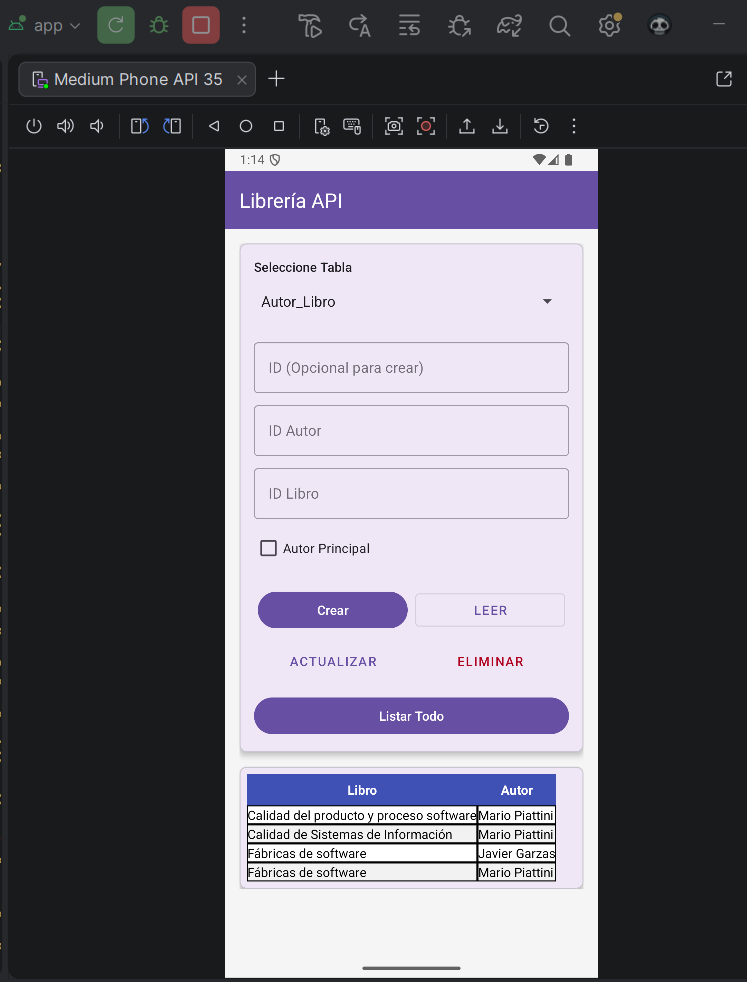

## 🗄️ Diagrama de Base de Datos

El siguiente diagrama representa la estructura de la base de datos utilizada por la API:

---

## 📱 Ejecución del Proyecto

### Pantalla Principal

### Registro y Consulta de Datos

### Resultado Final en la Aplicación Móvil

